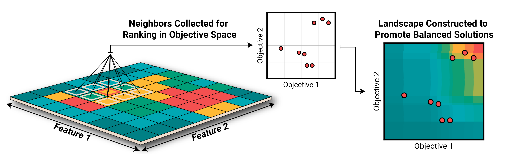

T-DominO MAP-Elites
==============================



Publication
------------
T-DominO is a simple method of optimizing multiple objective in MAP-Elites, targeting design exploration problems. It does _not_ find a Pareto front of solutions, but a single balanced solution in each bin.

Published at PPSN 2020. Full paper w/supplemental material on [arxiv](tbd).

<!--```bibtex
@inproceedings{tdomino2022,
  title={T-Domino: Exploring Multiple Criteria with Quality Diversity and Tournament Dominance Objective},
  author={Gaier, Adam and Stoddart, Jim and Villaggi, Lorenzo and Bentley, Peter},
  booktitle={International Conference on Parallel Problem Solving from Nature},
  year={2022},
  organization={Springer}
```-->


Code
------------
T-DominO is implemented as a type of archive in the PyRibs framework, overriding the `add` method to base tournaments on T-DominO rather than fitness. PyRibs and other dependencies are included in the environment, so getting it to run should be as simple as this:


Install the virtual environment with conda and activate it:

```bash
$ conda env create -f environment.yml
$ conda activate tdomino
```

Install alpha version of `bbq` (PyRibs boilerplate) in the virtual environment:

```bash
$ cd bbq; pip install -e .; cd ../
```

Install `tdomino` in the virtual environment:

```bash
$ pip install -e .
```

Test that a basic example runs

```bash
$ python test_run.py
```
